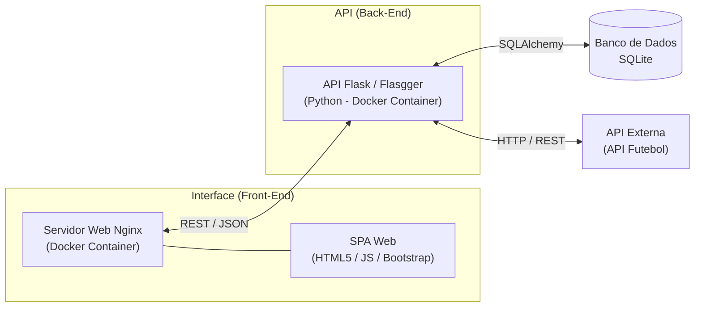

# PUC RIO - Desenvolvimento Back-end Avançado - MVP - Blog SPA

Este projeto é o MVP da sprint de Desenvolvimento Back-end Avançado, focado na construção de um SPA.

* Foco desta entrega: Desenvolvimento exclusivo da camada de interface (Frontend SPA), responsável pela interatividade, roteamento virtual e consumo dos serviços RESTful.
* Integração: Este componente foi projetado para consumir a API RESTful desenvolvida na etapa anterior, garantindo uma comunicação fluida entre os endpoints de persistência de dados e a experiência do usuário.

```text
Projeto base: https://github.com/marciocorbolan/puc-rio-sprint-desenvolvimento-full-stack-basico-mvp-spa
```

---

## 📋 Funcionalidades

* **Navegação sem refresh:** Manipulação dinâmica de elementos (seções/divs) para alternância de conteúdo sem recarregamento da página.
* **Comunicação REST:** Integração total com a API para operações de autenticação (JWT) e exibir dados do campeonatos.
* **Interface Dinâmica:**
    * **Home:** Exibição com layout customizado, incluindo cabeçalho visual, box de boas-vindas e grid de postagens.
    * **Autenticação:** Sistema de controle de acesso (Login/Registro) com persistência de token JWT e alternância contextual do menu.
    * **Área Logada:** Exibir dados do campeonato.

---

## 🛠️ Estrutura do Projeto



```text
puc-rio-sprint-desenvolvimento-back-end-avancado-mvp-spa/
├── css/
│   └── style.css          # Regras de estilização personalizadas e layout responsivo
├── js/
│   ├── api.js             # Módulo de serviço: consumo de endpoints REST (fetch + JWT)
│   ├── app.js             # Orquestrador da SPA (gerenciamento de rotas e estado)
│   └── ui.js              # Funções de renderização dinâmica de componentes (DOM)
├── assets/                # Imagens e ativos visuais
├── Dockerfile             # Configuração da imagem Docker
├── docker-compose.yml     # Orquestração do container front-end
└── index.html             # Ponto de entrada único (SPA)
```

### 📦 Pacotes

* **Nginx (Alpine):** Servidor web de alta performance utilizado no container Docker para servir os arquivos estáticos da SPA.
* **Bootstrap (v5.x):** Utilizado para a estrutura do sistema de grid responsivo, componentes de UI e utilitários de estilização.
* **Font Awesome:** Biblioteca utilizada via CDN para a inclusão de ícones na interface.
* **JWT-decode:** Biblioteca utilizada para manipular e decodificar tokens JWT armazenados no localStorage.  

### 🧠 Fluxo de Execução Técnica

A aplicação processa a interação do usuário através de camadas integradas:
* **Infraestrutura:** O navegador carrega o index.html e o app.js orquestra a SPA, gerenciando o estado da aplicação e as rotas virtuais sem recarregamento.
* **Camada de Interface:** O Bootstrap (via CDN) gerencia a estrutura responsiva e os componentes visuais, enquanto o JavaScript nativo manipula o DOM para renderizar o conteúdo dinamicamente.
* **Camada de Autenticação e Dados:** A aplicação utiliza o localStorage para persistência, a biblioteca JWT-decode para a validação contextual do usuário, e o módulo de serviço api.js para realizar requisições assíncronas (via fetch) aos endpoints RESTful.

### ⚙️ Ferramentas de Desenvolvimento
* **Visual Studio Code:** `sudo snap install code --classic`
* **Git:** `sudo apt install git -y`
* **Docker:** `sudo apt update && sudo apt install docker.io && docker-compose -y`

**Nota:** Após instalar o Docker, execute os comando abaixo e reinicie a sessão no terminal para poder rodar comandos Docker sem o sudo.

```bash
sudo usermod -aG docker $USER
newgrp docker
```

---

## 💻 Projeto

### 1. Clonar o repositório
```bash
git clone https://github.com/marciocorbolan/puc-rio-sprint-desenvolvimento-back-end-avancado-mvp-spa.git
cd puc-rio-sprint-desenvolvimento-back-end-avancado-mvp-spa
```

### 2. Requisitos básicos

* **Docker Compose - Inicialização (Recomendado):**
    * **Imagem Docker - Criação e Inicialização:** Constrói a imagem do projeto com todas as dependências e sobe o container em segundo plano (Ação única).
    ```bash
    docker compose up -d --build
    ```
* **Docker CLI - Execução Manual (Alternativa):** Caso prefira rodar usando apenas comandos nativos do Docker.
    * **Imagem Docker - Criação:** Constrói a imagem do projeto com todas as dependências.
    ```bash
    docker build -t puc-rio-sprint-desenvolvimento-back-end-avancado-mvp-spa .
    ```

    * **Contêiner Docker - Inicialização:** Sempre que fechar/abrir o terminal, será necessário iniciar o ambiente.
    ```bash
    docker run -p 8080:80 -v $(pwd):/usr/share/nginx/html puc-rio-sprint-desenvolvimento-back-end-avancado-mvp-spa
    ```

### 3. Acesso ao projeto 🚀

Abra o navegador WEB e acesse: http://localhost:8080

---

## 👤 Autor
* Márcio Corbolan - Desenvolvedor Principal

---

## 📄 Licença

Este projeto está sob a licença MIT - veja o arquivo [LICENSE](LICENSE) para detalhes.
